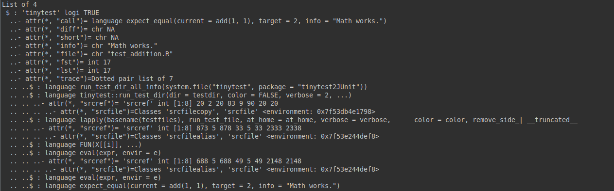
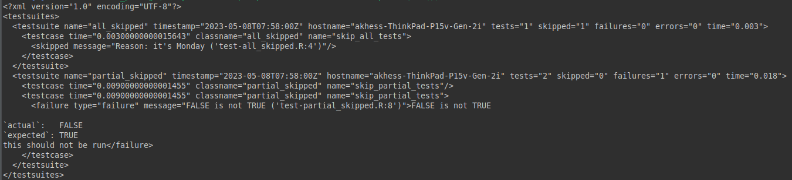

## Outline

* Motivation
* Sources
* Package Developement
* Testing Tinytests2JUnit
* 3 Ways to Run Tests
* Jenkins Demo
* Issues

## Motivation

* Tinytest is a lightweight, no-dependency, full-featured package for unit
  testing
* Testing language structure similar to `testthat` (`expect_*`)

 

* Applicability for Jenkins?
* Jenkins uses XML file format to report about the test suite execution
* Tinytest has no build in reporter for JUnit format:

  **-> Tinytest2JUnit**

## Sources

* git:
  [https://scm.openanalytics.eu/git/tinytest2JUnit](https://scm.openanalytics.eu/git/tinytest2JUnit)
* Redmine:
 [https://projects.openanalytics.eu/projects/tinytest2junit/](https://projects.openanalytics.eu/projects/tinytest2junit)
  * as subproject of "Team DST"

## Package Developement

  
* Convert tinytest test's results output to JUnit xml: 
    * Source code written by Lennart

{width=750px}
   
{width=750px}

&nbsp;

&nbsp;

tinytest object

&nbsp;

&nbsp;

&nbsp;

testthat xml format

## Testing Tinytests2JUnit {.columns-2 }

* Different test scenarios  
* To test the package we need to use the package itself
* master branch - test package functionality:
  * `test_writeJUnit.R` loops over example_tests folder
* separate branches for special test cases:
  * see Jenkins output - tests allowed to fail

{width=400px}

## 3 Ways to Run Tests in Tinytest

`tinytest::test_package("mypkg", testdir = "inst/tinytest")	
tinytest::test_all(pkgdir = "mypkg")
tinytest::run_test_dir(system.file("mypkg", package="tinytest2JUnit"))`

*  `test_package`: test a package during R CMD check -> causes Jenkins pipeline to fail
   on fail of any test
*  `test_all`: runs tests interactively -> causes pipeline to exit on fail of
   any test
* **`run_test_dir` is the only function that stores test results without exiting
  Jenkins pipeline**
  

## Jenkins Demo

* Updated Jenkinsfile: pipeline is working

{width=900px}

[https://ci.openanalytics.eu/job/git/job/tinytest2JUnit/](https://ci.openanalytics.eu/job/git/job/tinytest2JUnit/)

## Issues
### Pipeline fails with empty test folder

{width=1000px}

## Issues
### Pipeline fails with empty test folder

Can be easily fixed by running:

`tinytest::setup_tinytest("mypkg")`	

* sets up testing framework:
  * folder in `"inst/tinytest/"` that contains example test file
  * add `"tests/tinytest.R"`, which is needed to run tests during R CMD check
  * add tinytest to Suggests in DESCRIPTION file
  
## Issues

### Test Duration is not reported {.centered}

* test duration is only reported per test file not per test

::: {.centered}
{width=1000px}

&nbsp;

tinytest vs. testthat
:::

## Issues
### Skipped tests are not reported

* information on skipped test is pasted during test run, but not stored inside
  tinytest object
  
   {width=900px}

